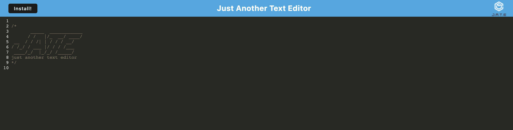

# 19: PWA Text Editor     

## Description

A Text Editor that can run in the browser or be downloaded as Progressive Web Application. Built with Webpack and IndexedDB.    
  

## Table of Contents

- [Installation](#installation)
- [Usage](#usage)
- [License](#license)
- [Tests](#tests)
- [Credits](#credits)
- [How to Contribute](#how-to-contribute)
- [Questions](#questions)

## Installation
Optional installation: visit the [deployed site](https://rkgs-pwa-text-editor.herokuapp.com/) and click "Install!" to download the PWA.

## Usage
Visit the [deployed site](https://rkgs-pwa-text-editor.herokuapp.com/). Start adding text snippets immediately in the browser, or download the PWA for later offline use.

## License

This project is covered under the following license: MIT License  
Refer to LICENSE in the repo for additional details.

## Tests

N/A

## Credits

N/A

## How to Contribute

[Contributor Covenant](https://www.contributor-covenant.org/)

## Questions

For questions or suggestions, contact:  
GitHub: [@aerostokes](https://github.com/aerostokes)  
Email: [rhonda@aerostokes.com](mailto:rhonda@aerostokes.com)